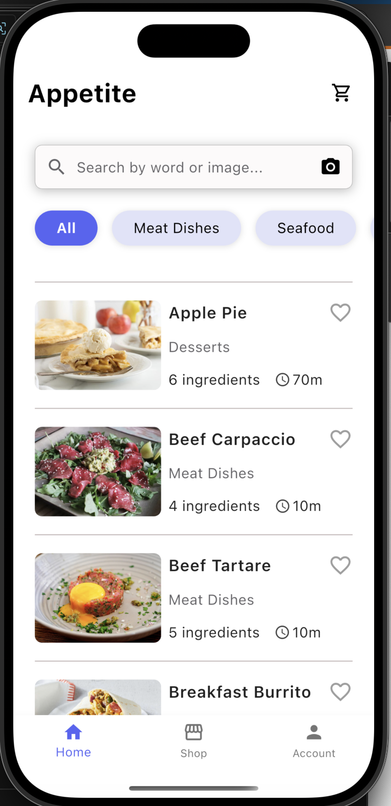
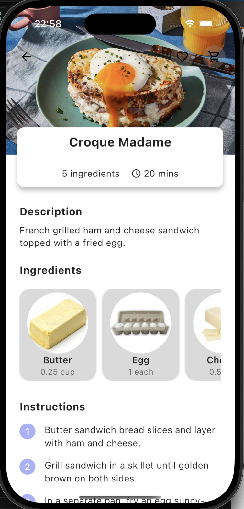

# Appetite - Mobile Cooking Backend Server

  
  

**[Click here to view the Appetite Mobile App Project](https://github.com/hongdnn/appetite_mobile)**

## Description

**Appetite** is the backend server powering a mobile cooking assistant app. It enables users to search for foods by image or natural language, discover recipes, and get detailed ingredient information.

- Built a Flutter app with food image search using a self-trained PyTorch classifier on a 6.5 GB dataset.
- Integrated a LangChain assistant with Gemini and FastAPI to help users discover recipes via natural language.
- Supports food and ingredient recognition, user authentication, and recipe management.

## Features

- 🔍 **Food Image Search:** Upload a food photo and get instant recognition and recipe suggestions.
- 🤖 **AI Assistant:** Ask questions about foods, ingredients, or recipes using natural language.
- 🗄️ **Robust Backend:** FastAPI-based API with JWT authentication, async database access, and modular service/repository architecture.
- 🧑‍🍳 **Recipe Discovery:** Browse, search, and save recipes with detailed ingredient breakdowns.

## Tech Stack

- **FastAPI** (Python)
- **PyTorch** (image classification)
- **LangChain** + **Gemini** (AI assistant)
- **PostgreSQL** (database)
- **JWT** (authentication)
- **Flutter** (mobile frontend)